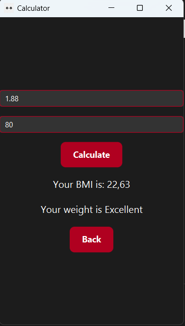
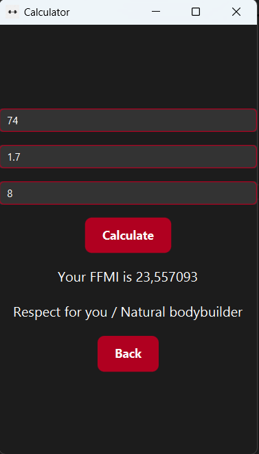
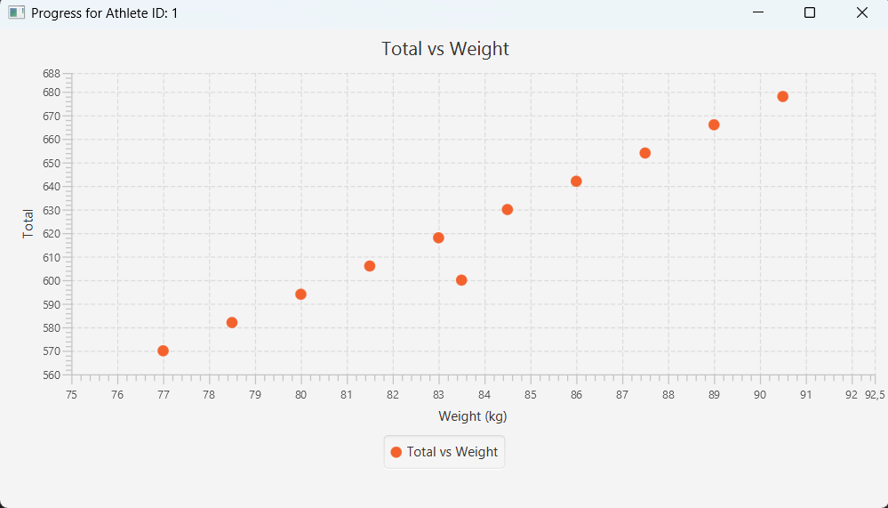
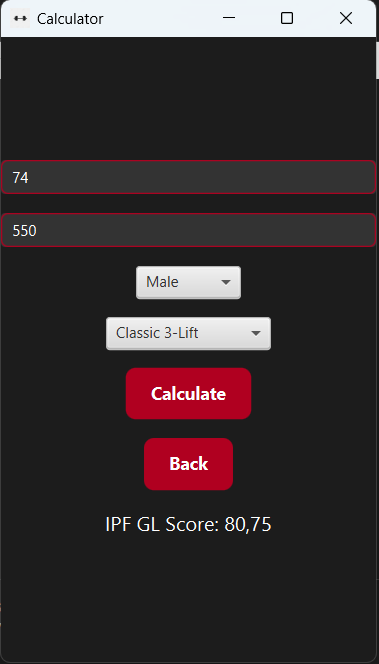
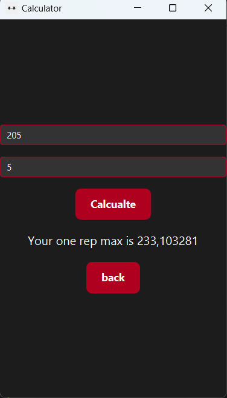
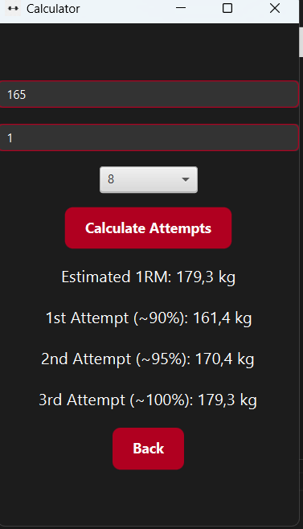
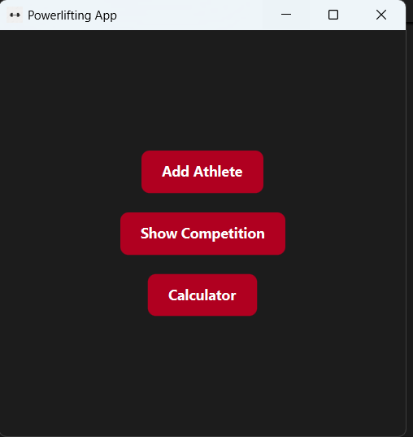

# 🏋️ Powerlifting App

 JavaFX desktop application designed for managing powerlifting competitions and athlete statistics. Built with passion to assist coaches, athletes, and enthusiasts in analyzing lifter performance, and calculating key training metrics.

---

## 📌 Features

- 👤 **Athlete Management**
  - Add athletes with name, age, federation, sex, height, weight, and lifting data
  - Track their progress with dates of lifts

- 📊 **Competition Overview**
  - View lifters in a sortable, searchable table
  - Sort by **Total**, **Body Weight**, or **IPF GL Score**
  - Search by **name** or **federation**
  
  

- 📥 **CSV Export / Import**
  - Save results to a file or load from existing data

- 📈 **Training Calculators**
  - **BMI**: Body Mass Index
    
  - **FFMI**: Fat-Free Mass Index
    
  - **BMR**: Basal Metabolic Rate
    
  - **IPF GL Score**: Based on event type and sex
    
  - **1RM**: One-Rep Max (McGlothin formula)
    
  - **Meet Attempts**: Generate 3 attempts based on RPE
    

- 📅 **Progress Visualization**
  - Double-click an athlete row to generate charts:
    - Total vs Weight
    
---

## 🎨 Interface

- Clean JavaFX layout
- Styled with custom **CSS** (dark mode: black & red)



---

## 🛠️ Technologies Used

- Java 20
- JavaFX (UI Toolkit)
- Maven (Build system)
- CSS (Custom styling)
- JUnit 5 (Testing)

---

## 📁 Project Structure

```plaintext
src/
├── main/
│   ├── java/
│   │   └── com/example/powerlifting_app/
│   │       ├── Core/         # Logic (Athlete, Result, Competition)
│   │       ├── GUI/          # Forms, tables, charts
│   │       ├── Utils/        # CSV import/export
│   │       └── HelloApplication.java
│   │       └── HelloController.java
│   └── resources/
│       └── com/example/powerlifting_app/
│           ├── style.css     # Styling
│           └── logo.jpg      # Icon
└── test/
    └── java/
        └── com/example/powerlifting_app/
            └── CoreClassTests.java  # Unit tests
```

---

## 🧪 Testing

Unit tests written with JUnit 5 to ensure correctness of:
- Athlete BMI calculation
- Total and IPF GL computation
- Sorting mechanisms in Competition

---

## 🚀 Future Plans

- [ ] SQLite database integration
- [ ] Authentication and user profiles
- [ ] Additional calculators (e.g. Wilks, Sinclair)
- [ ] Polish & deploy a native installer

---

> Built with 💪 by a powerlifting enthusiast and aspiring software developer.

